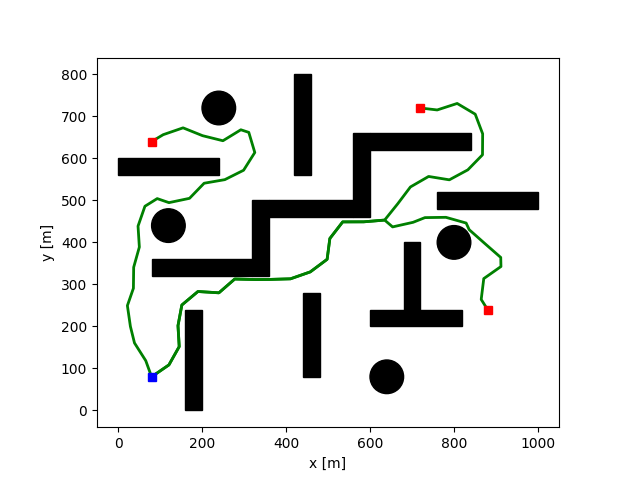

# Multi-target RRT for UAVs path planning with dynamic constraints

## Demo
```
$ python3 contraint_rrt.py
$ python3 post_processing.py
```

## Results


## Citation
```
@ARTICLE{tbd,
  author={Khuat, Thu Hang and Bui, Duy Nam and Phung, Manh Duong},
  journal={}, 
  title={Multi-target RRT for UAVs path planning with Dynamic constraints}, 
  year={},
  volume={},
  number={},
  pages={},
  doi={}}
```