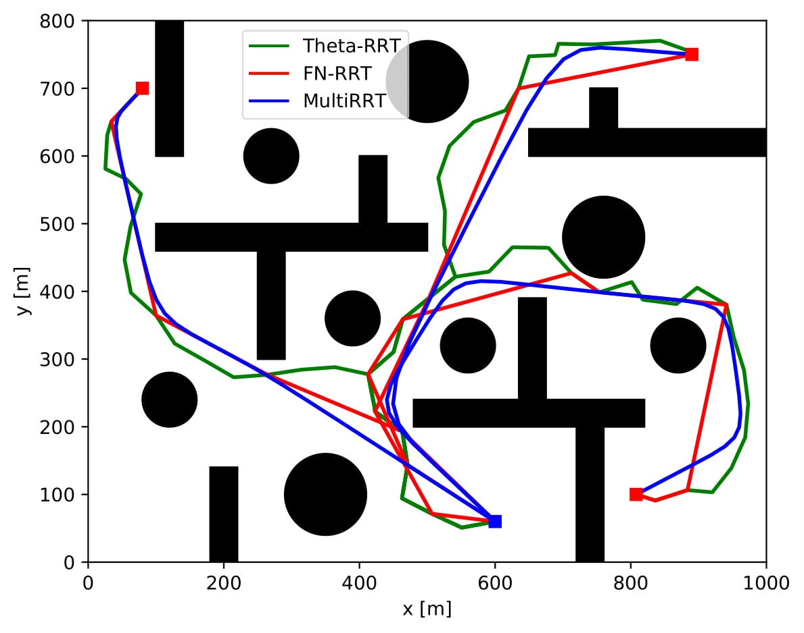
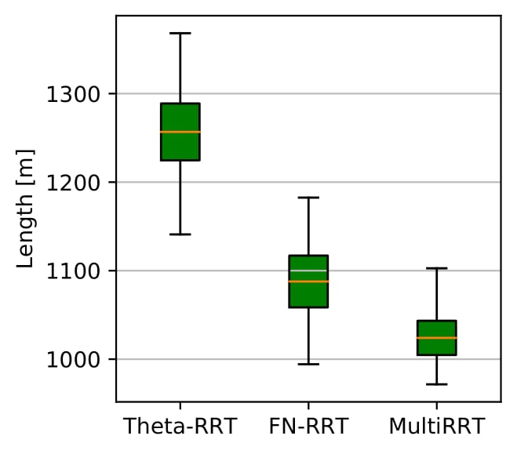
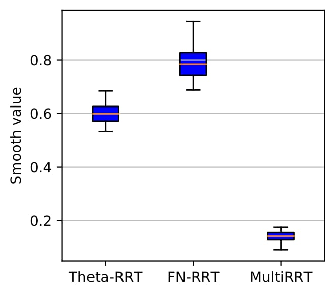
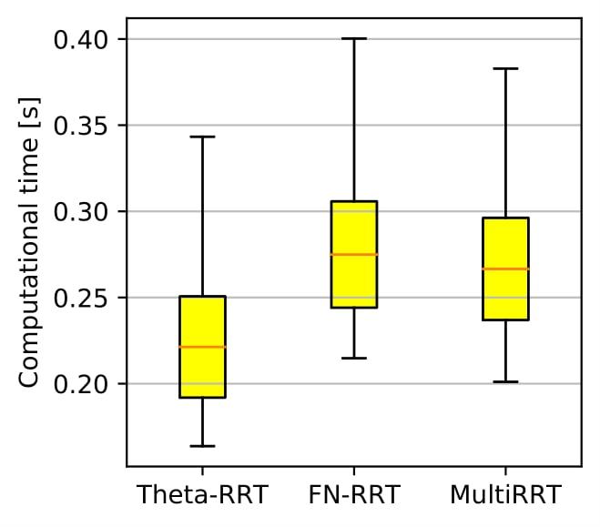

# Multi-target RRT for UAVs path planning

This repository presents the following article in Python:

Thu Hang Khuat, Duy-Nam Bui, Hoa TT. Nguyen, Mien L. Trinh , Minh T. Nguyen , Manh Duong Phung, "**Multi-goal Rapidly Exploring Random Tree with Safety and Dynamic Constraints for UAV Cooperative Path Planning**," *Preprint*. 
<!-- [[**IEEE** *Xplore*](https://ieeexplore.ieee.org/abstract/document/9732989)] [[Citation](#citation)] -->

## Installation
```
git@github.com:duynamrcv/multi-target_RRT.git
```

## Run simulation
The current version have four different scenarios, from 1 to 4. Before run our method, please change the value of `scenario` in file. To run our method, run:
```
python3 contraint_rrt.py
python3 post_processing.py
```

We also implement some methods to conduct the comparisons, i.e. `compare_*.py`. To run those methods, run:
```
python3 compare_rrt_star.py
python3 compare_rrt_smart.py
```

The data will be saved in `*.txt` file. This file is used for the statistic, i.e. `analys_*.py`.

## Results and Comparison
### Path


### Comparisons
|  |  |   |
| :---:        |     :---:      | :---:        |
|     |     |   
